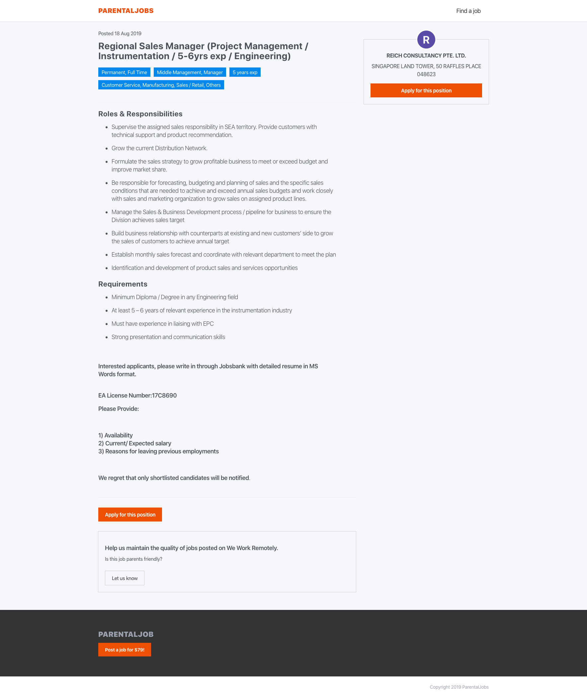

# Jobs portal

This is a hackaton project, feel free to use anyway you want.

### Web:
Clone the project to your local folder:

The project is structured into 2 parts

```
| packages - frontend
| pacakges - backend
```
Since we are using yarn workspace, you can install the web project with:

```
yarn install
```
in the root folder, this will install node_modules in root folder and alias to `packages/*` so that you don't have to go into each folder to install, and start by

```
yarn dev
```

Open your browser with port 3000, `http://localhost:3000`


## Frontend:

Frontend is using ReasonReact / ReasonML.

Frontend has a type system to encode and decode to backend database which is using Atdgen, this will also make sure that we write proper types for our data. Atdgen can be installed by oCaml package manager `opam`.

install oCaml id you don't have yet.

```
brew install ocaml
```
now setup the ocaml

```
opam init -a
opam switch create . 4.07.1 -y
```
and using opam to install atd and atdgen

```
opam pin add atd --dev-repo   
opam pin add atdgen --dev-repo
```
at this point you should be able to see your atdgen version `atdgen --version`, if you don't probably you need to set your enviroment to opam `eval (opam env)` and try again.

and try to run `yarn build:types` this will build type system which we use to decode and encode.

## Backend:

Backend currently using NodeJs + Mongo,

### Start a MongoDB Server

Download the right MongoDB version from MongoDB
Create a database directory (in this case under /data).
Install and start a mongod process.
mongod --dbpath=/data

You should see the mongod process start up and print some status information.

The mongo database was dumped in /dump

to restore:

```
mongorestore --host localhost --port 27017 --db ./dump/parentalJobs
```

### Crawler:

Crawler will crawl `skillfuture website` recusivly using puppeteer(for js execution), currently set to total crawl page to 50.

```
yarn crawl
```

Crawler is written in nodejs using puppeteer, might not be most effective way, but it does the job that crawls js executed site, for now.

Tried on local machine, the first time I tried I took 30mins for 2000 js executed pages. the last try with my external monitor off, and stop some youtube videos, it took about 15-20 mins, nearly half faster, btw still should probably setup some clustering for the crawler.


## Features

This is a mvp version, there are list of features to be work after the submission of this mvp:

- [ ] Allow submit logo in new job.
- [ ] Type safety in backend and frontend.
- [ ] Create a user auth.
- [ ] User invoice.
- [ ] Improve pagination.
- [ ] Crawl mutltiple job portal sites, this is a big work, the crawler will have to keep running, keep improving this carwler is important.


